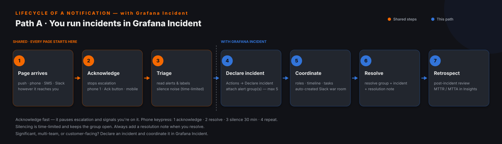
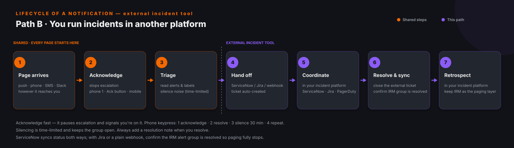

# Grafana IRM Responder Playbook

For the people who carry the pager. This guide gets you set up to be reached, then walks the **lifecycle of a notification** — exactly what to do from the moment you're paged. It covers two coordination paths: **Path A**, teams that run incidents in **Grafana Incident**, and **Path B**, teams that run incidents in a **separate platform** (ServiceNow, Jira, PagerDuty, or a custom tool). It draws on the [Responder Notification Setup](../notification-setup/grafana-irm-responder-notification-setup-best-practices.md), [Escalation Chains](../escalation-chains/grafana-irm-escalation-chains-best-practices.md), and [Incident Management](../incident-management/grafana-incident-management-best-practices.md) guides.

---

## Part 1 — Before your shift: make sure you can be reached

A perfect schedule and escalation chain page *no one* if your notifications aren't set up — and **email is the silent default**. Do this once, before you're ever on call (full detail in the [Responder Notification Setup guide](../notification-setup/grafana-irm-responder-notification-setup-best-practices.md)):

- **Configure both notification chains.** In Profile → IRM → Notification rules, set up your **Default** chain (everyday: push, Slack) and your **Important** chain (critical: mobile push critical, phone call, SMS). An Important escalation step does nothing for you if your Important chain is empty.
- **Install and pair the mobile app**, and turn on critical alerts — iOS: enable **Critical Alerts** at the OS level, then "Override DND for important"; Android: set per-channel DND and volume. Sync the IRM contact so calls can bypass Do Not Disturb.
- **Verify your phone number** (E.164 format) for SMS and voice calls.
- **Link Slack** (and Teams/Telegram if your org uses them) in your IRM profile.
- **Send a test notification on both chains** — untested is unconfigured.

If you can't do all of that, you're not ready to take the pager. The checklist workbook that ships with this playbook tracks it per responder.

---

## Part 2 — The lifecycle of a notification

When a page arrives, the first three steps are the same no matter how your team runs incidents. Then the path forks based on scope.

### The shared start — every page begins here

1. **Answer the page** on whatever channel reached you (push, phone, SMS, or Slack).
2. **Acknowledge immediately.** This *stops the escalation chain* and signals you're on it — a new alert joining an acknowledged group won't re-trigger escalation. Acknowledge via: phone **press 1**, Slack **Acknowledge** button or `/ack`, mobile **Acknowledge**, or web **Status → Acknowledge**.
3. **Triage the alert group.** Open the details: read the grouped alerts, labels, and timeline. If it's noise or a known issue you're already fixing, **silence** it (time-limited — phone **press 3** silences for 30 minutes; the group stays open and re-fires when the silence ends). Otherwise, investigate.

Then decide the scope:

- **Routine and self-contained?** Fix it, then **resolve** the alert group (phone **press 2**, or the Resolve button) and **add a resolution note**. You're done.
- **Significant, multi-team, or customer-facing?** Escalate to a coordinated incident — follow **Path A** or **Path B** below.

If you need help at any point, **pull people in**: add participants on the alert group (web **+ Add participants**, mobile **+ Invite** with Default or Important priority), or in Slack use the **Escalate** button or `/grafana escalate @user`. Check whether someone shows as **On-call now** before paging them.

### Responder actions by channel (quick reference)

| Action | Phone call | Slack | Mobile app | Web UI |
|---|---|---|---|---|
| Acknowledge | Press **1** | Ack button / `/ack` | **Acknowledge** | Status → Acknowledge |
| Resolve | Press **2** | Resolve button | **Resolve** (+ note) | Resolve (+ note) |
| Silence | Press **3** (30 min) | Silence button | More → **Silence** | Silence (pick duration) |
| Repeat message | Press **4** | — | — | — |
| Escalate to others | — | **Escalate** / `/grafana escalate @user` | **+ Invite** / New escalation | **+ Add participants** |
| Add resolution note | — | 🤖 reaction / message shortcut | prompted on resolve | Add note |

SMS is notification-only (no keypress actions); use the app, phone, Slack, or web to act. Voicemail does **not** acknowledge or resolve — only a live keypress does, so an unanswered call keeps escalating.

### Path A — you run incidents in Grafana Incident

When the event needs coordination:

1. From the alert group details, choose **Actions → Declare incident** (or `/grafana incident new <severity> <title>` in Slack). Fill in title, severity, and labels.
2. **Attach the contributing alert group(s)** — up to **5 per incident** — so the technical context travels with the incident. Labels flow from the alert group to the incident automatically.
3. **Coordinate** in the auto-created Slack war room: assume roles (Commander/Investigator), keep the timeline current, and track action items as **tasks**. Post stakeholder **status updates**.
4. **Mitigate, then resolve** — resolve the incident (with a summary) and the alert group, and add a **resolution note**.
5. **Retrospect** — finalize the timeline, run a blameless post-incident review, and let MTTR/MTTA flow into Insights.

### Path B — you run incidents in another platform

Here IRM is your **paging / on-call layer** and the incident record lives in ServiceNow, Jira, PagerDuty, or a custom tool. After the shared acknowledge/triage:

1. **Hand off to the external tool.** Depending on your integration, this is automatic or a chain step:
   - **ServiceNow** — an IRM alert group **auto-creates a ServiceNow incident**, and status syncs **both ways** (e.g. Firing→New, Acknowledged→In Progress, Resolved→Resolved); resolution notes can sync too. Resolve in *either* system and the other follows.
   - **Jira** — declaring an incident **auto-creates a Jira issue** and the issue status follows the incident status; tasks link bidirectionally. (Jira Cloud only; note IRM only sends Summary/Description/Project/Issue Type on create.)
   - **Outgoing webhook** (PagerDuty or custom ITSM) — a **"Trigger outgoing webhook"** escalation step (or an event trigger) creates/updates a ticket. Status does **not** sync back automatically unless the external tool calls IRM's API.
2. **Coordinate in your incident platform** — that tool owns the incident record, comms, and roles.
3. **Resolve & sync.** Close the ticket in the external tool, and **confirm the IRM alert group is resolved** so paging fully stops. With ServiceNow this is automatic; with Jira or a plain webhook, verify it explicitly.
4. **Retrospect** in your incident platform.

The golden rule for Path B: **the alert group in IRM must end up Resolved**, or IRM will keep paging even after your external incident is closed.

---

## Part 3 — Good habits on call

- **Acknowledge first, investigate second.** Acknowledging is cheap and stops the noise for everyone; you can always resolve or escalate after.
- **Silence deliberately.** Use short, time-limited silences for known issues during a fix; avoid "Silence forever."
- **Always leave a resolution note** — future-you (and the retrospective) will thank you. Your org may require one.
- **Escalate early** if you're stuck; a second responder beats a prolonged outage.
- **Hand off cleanly at end of shift** — make sure nothing is left Firing or in an open silence, and brief the next responder on anything in flight.

## When you get paged — the one-page checklist

- [ ] Answer the page (push / phone / SMS / Slack)
- [ ] **Acknowledge** immediately (phone 1 · Ack · mobile) — this stops escalation
- [ ] Open the alert group; read alerts, labels, timeline
- [ ] Noise or known issue? **Silence** (time-limited). Otherwise investigate
- [ ] Need help? Add participants / `/grafana escalate @user`
- [ ] **Decide scope:**
  - Routine → fix, **Resolve** (phone 2), add resolution note — done
  - Significant → **Path A**: Actions → Declare incident, attach group(s), coordinate, resolve, retrospect
  - Significant → **Path B**: hand off to ServiceNow/Jira/webhook, coordinate there, close ticket, **confirm the IRM group is resolved**
- [ ] Add a resolution note; confirm nothing is left Firing

## References

- [Respond to alerts](https://grafana.com/docs/grafana-cloud/alerting-and-irm/irm/respond-to-alerts/)
- [Phone and SMS (keypress menu)](https://grafana.com/docs/grafana-cloud/alerting-and-irm/irm/notify-responders/phone-and-sms/)
- [Slack integration](https://grafana.com/docs/grafana-cloud/alerting-and-irm/irm/integrations/chat-and-collaboration/slack/)
- [IRM mobile app](https://grafana.com/docs/grafana-cloud/alerting-and-irm/irm/mobile-app/)
- [Declare an incident](https://grafana.com/docs/grafana-cloud/alerting-and-irm/irm/manage-incidents/declare-incident/)
- [Best practices: alert groups](https://grafana.com/docs/grafana-cloud/alerting-and-irm/irm/guides/best-practices/alert-groups/)
- [Outgoing webhooks](https://grafana.com/docs/grafana-cloud/alerting-and-irm/irm/integrations/custom-integrations/outgoing-webhooks/)
- [ServiceNow integration](https://grafana.com/docs/grafana-cloud/alerting-and-irm/irm/integrations/alert-sources/servicenow/)
- [Jira integration](https://grafana.com/docs/grafana-cloud/alerting-and-irm/irm/integrations/dev-and-operations/jira/)
- [Responder Notification Setup guide](../notification-setup/grafana-irm-responder-notification-setup-best-practices.md)

<!-- related-resources:start (auto-generated by build_repo_docs.py) -->

## Related guides

- [Responder Notification Setup](../notification-setup/grafana-irm-responder-notification-setup-best-practices.md) — How responders actually get paged — the foundation everything else depends on.
- [Incident Management](../incident-management/grafana-incident-management-best-practices.md) — Declare, coordinate, resolve, and learn from incidents.
- [Escalation Chains](../escalation-chains/grafana-irm-escalation-chains-best-practices.md) — From first page to declared incident — escalation that never drops an alert.

_Part of the Grafana IRM enablement series — each topic also has an enablement deck and an implementation checklist in its folder._

<!-- related-resources:end -->
